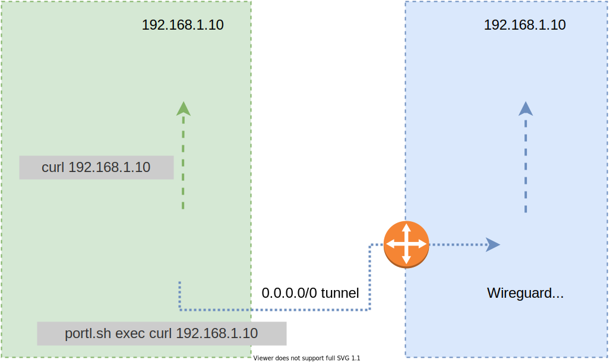

# Portl

Bash script to start Wireguard in its own Linux network namespace and then run arbitrary commands within that namespace. This "portals" individual process traffic through the Wireguard interface without affecting traffic for any other process. Requires root access.

Portl is useful if you want select programs to (be forced to) use Wireguard as a full VPN without affecting traffic from the rest of your system or having to calculate complicated AllowedIP ranges for some excluded IPs (like your local subnet). It's also a good solution for when you want a specific tool to be able to access local and on-VPN network resources, but have the same (or overlapping) subnet CIDRs on the local and remote ends.

<div align="center">


</div>

Requires GNU `sed`, `grep`, `cut`, and `tr` to be installed. If you get errors about unsupported flags in these commands it's probably because you have a BSD (POSIX) version installed.

## Usage

`portl.sh [command] [arguments]`

Commands:
- `config path/to/config/file`: specify a Wireguard configuration file to use (caveats below).
- `up`: brings up a namespaced Wireguard interface using the config file specified previously.
- `show`: shortcut to run `wg show` within the configured namespace.
- `down`: removes the Wireguard interface and namespace created by `up`.
- `exec [command]`: run an arbitrary command within the namespace created by `up`.
- `run [command]`: same as `exec`.

Note that the namespace and interface names are defined at the top of the script and can be changed. By default the namespace is `portl` and the interface is `portl0`. The rest of this documentation will describe the script's behavior assuming those values remain unchanged.

The script requires root privileges to function. The first thing it does is check if it's running as root, and if not it automatically attempts to elevate to root using `sudo`. This may prompt the user for credentials.

### config
The specified config file should be one that is compatible with `wg` (see the CONFIGURATION FILE FORMAT section [here](https://www.man7.org/linux/man-pages/man8/wg.8.html)), plus the (required) `Address` and (optional) `DNS` options supported by `wg-quick` (detailed [here](https://man7.org/linux/man-pages/man8/wg-quick.8.html)). **ANY OTHER `wg-quick`-SPECIFIC OPTIONS USED BESIDES `Address` OR `DNS` WILL BE SILENTLY IGNORED.** Comments (`#`) are fine and will be respected/preserved, but avoid using a `#~` combination anywhere because that is used as a special marker for parsing the supported `wg-quick` commands.

At a minimum, the config file should contain the following:
```
[Interface]
PrivateKey = [base64 private key]
Address = [address/subnet to be used by the client]

[Peer]
PublicKey = [server's public key]
AllowedIPs = [IP range(s) for traffic that should be sent over wireguard]
Endpoint = [server IP or FQDN]:[port] #default port is 51820
```
- You may also swap out the Peer's `Endpoint` for an Interface `ListenPort` if you want to act more like a server and have the peer initiate connections to this machine.

The specified config file will be copied to `/etc/wireguard/portl0.conf`. `Address` and `DNS` lines (not supported by `wg`) will be commented out but parsed later by the `up` command to configure the interface. The config file will persist after the interface is removed (via the `down` command or otherwise) so you should only need to run `config` once unless configuration changes are needed.

### up
Uses the config file at `/etc/wireguard/portl0.conf` (created via the `config` command) to create a Wireguard interface named `portl0` located in the `portl` network namespace.

If the original config file contained `DNS=IP` options (also allowing multiple comma-separated IPs), those will be parsed and applied as `nameserver [IP]` values to a `resolve.conf` file specific to the `portl` namespace. This is done by writing the values to `/etc/netns/portl/resolve.conf`, which Linux will make available inside the namespace at the standard `/etc/resolve.conf` location without affecting that file outside the namespace. Like the config file in `/etc/wireguard/`, this namespaced `resolve.conf` file will be persistent and remain in use until modified manually or by the `config` command. If `/etc/netns/portl/resolve.conf` does not exist (either because it is deleted or DNS was never specified in a config file) then the namespace will use the same `/etc/resolve.conf` file as the main OS.

### show
Shortcut to run `wg show` within the namespace.

### exec
Runs the specified command as the current user (even when `sudo` is used to run the script as root). To run the specified command as root just specify `sudo` as part of the target command. E.g. `portl.sh exec sudo iptables -L`.

Pretty much any command that you would normally run in from your shell can be used and should work as expected. You can even use something like `bash` as the target command to open a shell within the namespace, then return to the parent shell with `exit`.

### run
Same as `exec`.

### down
Brings down the namespaced Wireguard interface, then deletes the `portl` namespace (and all network interfaces in it). Any configuration options specified with the `config` command will be preserved (no need to run `config` again after `down`), but any namespace-specific changes that were made inside the namespace (e.g. iptables rules) will be lost.

# Docker Version (dportl.sh)
This script is the same as the original `portl.sh`, except it moves the wireguard interface into an existing docker container's namespace instead of creating a new `portl` namespace. As part of this process it also deletes all existing network interfaces inside the container, except for `lo` (loopback).
- Deleting other interfaces ensures container traffic is forced through the Wireguard interface, but will probably break things if the container is meant to communicate with any other containers or do any other special local networking activity.

It accomplishes this by running commands inside the namespace from the host, so they will work even if the container doesn't have all the tools/programs that the script runs. In particular, the container doesn't need to have wireguard installed inside it.

Usage is exactly the same as the `portl.sh` script described above, except the `up` command takes a single argument: the truncated 12-character `CONTAINER ID` of the target container, as displayed by `docker ps`. E.g. `dportl.sh up a1b2c3d4e5f6`.
